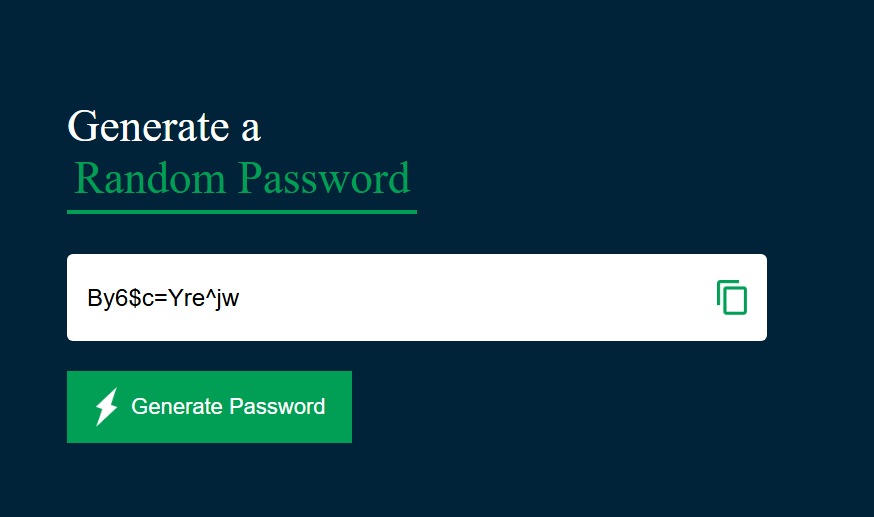

🔒 Random Password Generator
A simple and sleek random password generator built with HTML, CSS, and JavaScript. Easily create secure, random passwords to help keep your online accounts safe!

✨ Features
Generate strong, random passwords instantly

Copy password to clipboard with a single click

Responsive and clean UI design

## 🚀 Live Demo

[Click here to try the Password Generator!](https://random-password-generator-004.netlify.app/)

## 📸 Preview

🚀 How to Use
Open the project in your browser.

Click the "Generate Password" button.

Copy your new password and use it wherever you need!

🛠️ Built With
HTML - For the structure

CSS - For styling and layout

JavaScript - For functionality and password generation logic

🧠 How It Works
A set of characters (uppercase, lowercase, numbers, symbols) is defined.

The script randomly selects characters based on the chosen length.

Password is displayed on the screen and ready to be copied.
